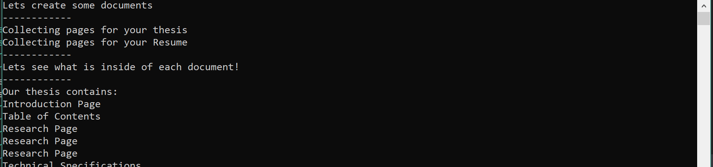

# Lab42-FactoryPattern
This lab is an exploration into Design Patterns and the Factory Method Design Pattern specifically. In this example, we are using documents as our main concept.

For our pattern, it follows as such:
Product - Page
Concrete Product - Page Type (Cover Letter, Table of Contents, etc)
Creator - Document
Concrete Creator - Document Type (Resume, Thesis etc)

This takes the understanding that our documents consist of different pages. Each of these types of pages are what our document types consist of. Our product in this example is an abstract class as it makes more sense in this usage of it.

This project was built with the latest .Net Core SDK and is a simple console app.
***
## Getting Started
1. Download the files
2. Navigate to the project and open it in Visual Studio. After running without debugging, a console window should appear with text outputting the creation of a thesis and a resume as well as what pages are used to create those documents.

## Visuals

